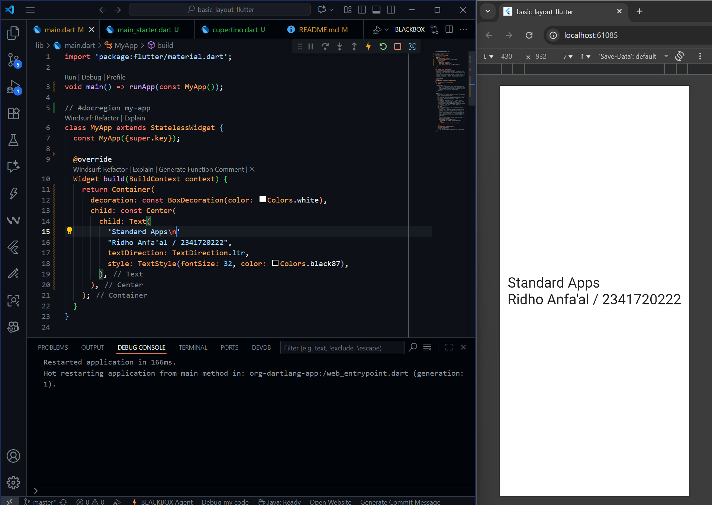
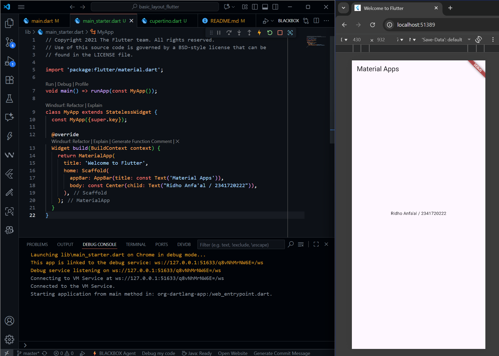
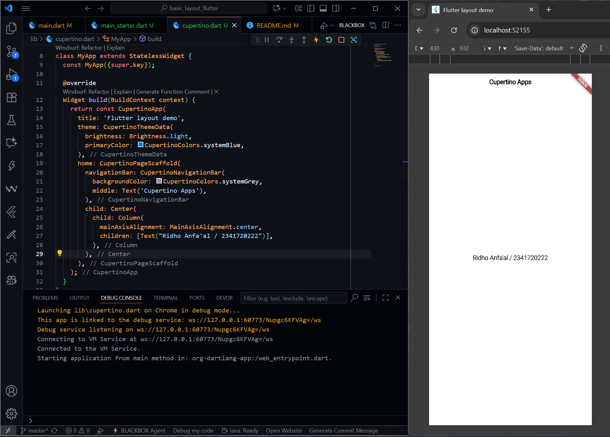
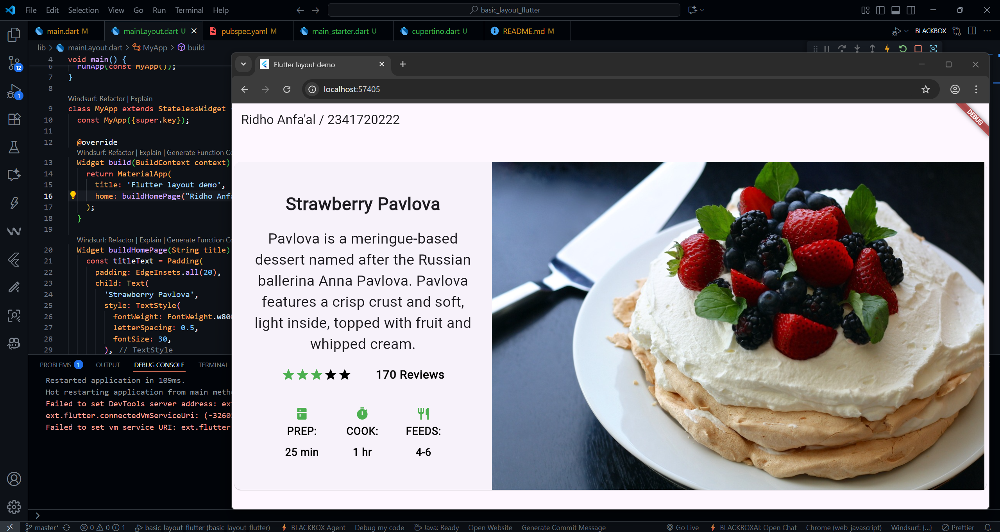
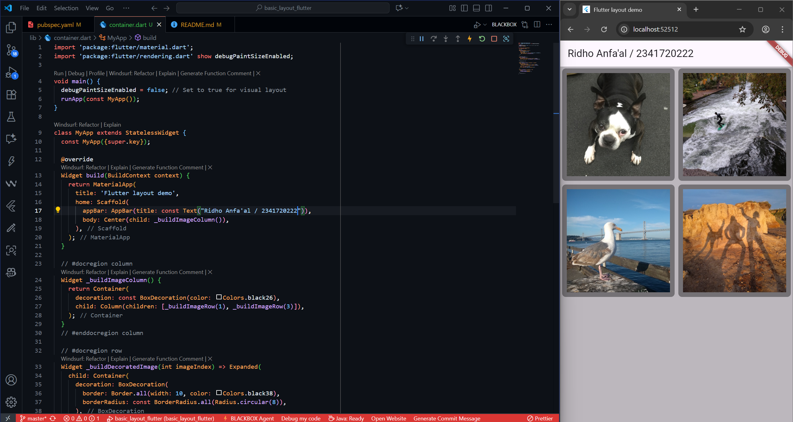
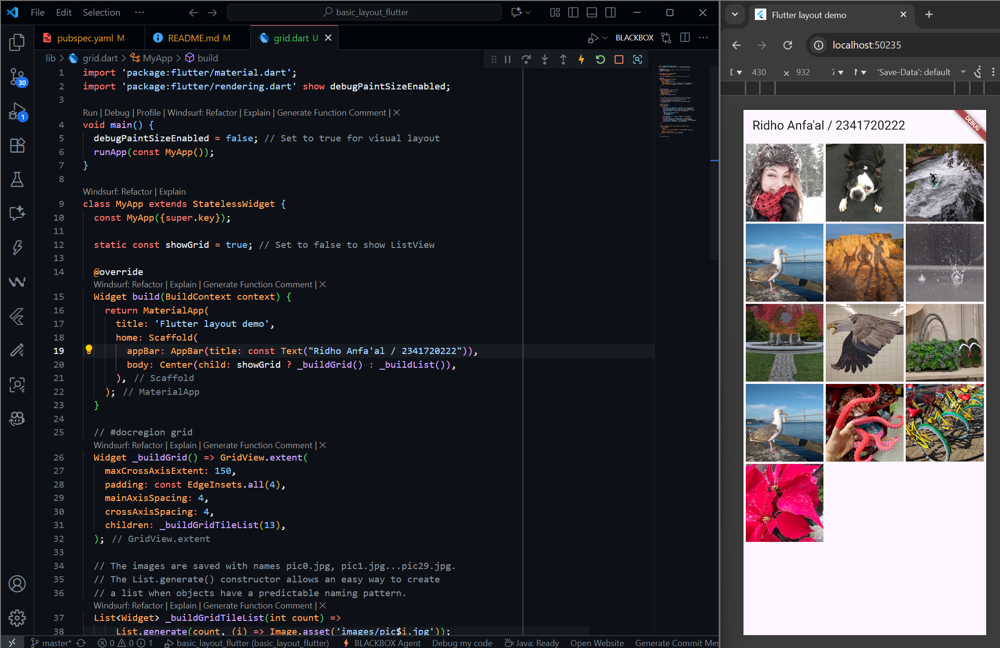
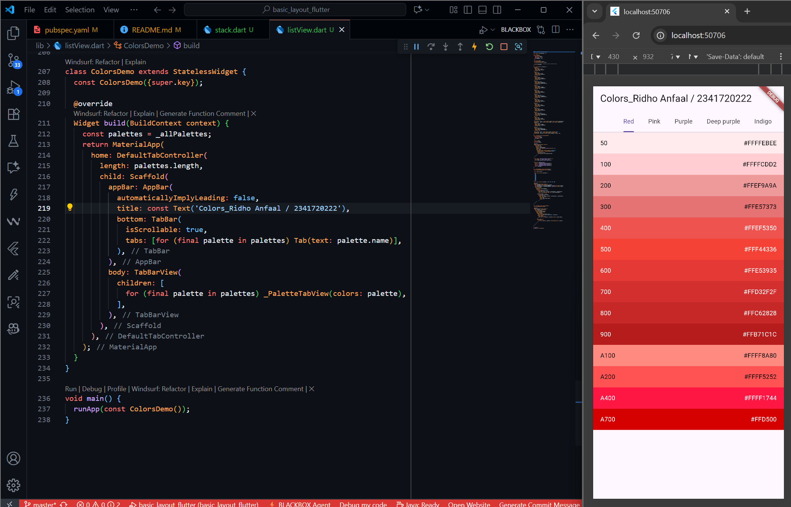
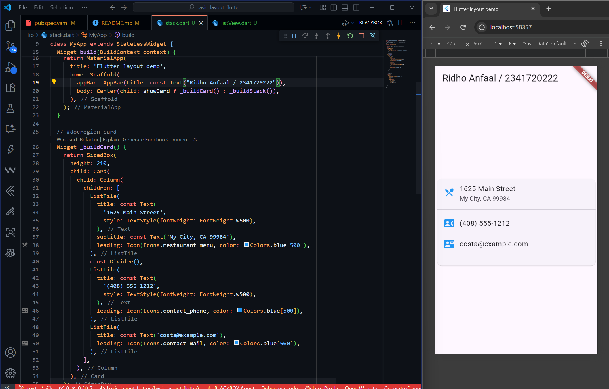
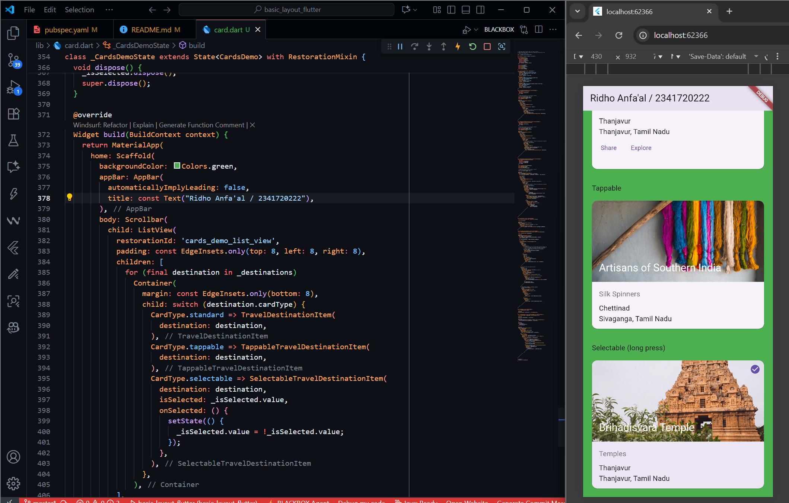

# Layouts in Flutter

## Layout a widget
- ### Standard apps
  

  This practicum create a basic application using core widgets without material or cupertino designs. The root layout is established with a Container widget featuring a white background from the BoxDecoration property. 

- ### Material apps
  

  It utilizes the MaterialApp widget for themes, navigation, and visual styling, while the Scaffold widget structures the layout with features like an AppBar and centered Text widget. 

- ### Cupertino apps
  

  This practicum create an iOS-style interface using Flutter's Cupertino library. It begins with a CupertinoApp widget for the iOS aesthetic, featuring light themes and primary color settings. Using a CupertinoPageScaffold and a navigation bar.

## Lay out multiple widgets vertically and horizontally

  This practicum focuses on arranging Flutter widgets both vertically and horizontally using layout widgets like Row, Column, and Container, aimed at creating a structured user interface showcasing a dessert description Strawberry Pavlova. It begins with the MaterialApp widget for app theming, followed by defining UI components in the buildHomePage() function. Key features include a Text widget with padding for the title and subtitle, a ratings section with star icons using a Row, and an icon list utilizing nested Column widgets for alignment. Text formatting maintains consistency through DefaultTextStyle.merge(). The layout includes a leftColumn for vertical arrangements alongside a mainImage in a parent Row, all wrapped in a Card widget.

## Common layout widgets
- ### Container
  

  A Container is one of Flutter’s most versatile layout widgets. It allows us to control spacing (padding, margin), decorate widgets (add borders, background colors, or images), and even define size constraints. It only has one child, but that child can itself be complex (like a Row, Column, or Stack).

- ### GridView
  

  GridView lays widgets out in a two-dimensional scrollable grid. We can define how many columns or how wide each tile should be using constructors like:
  GridView.count() → specify number of columns.
  GridView.extent() → specify max width of each tile.
  It automatically provides scrolling when the content overflows.

- ### ListView
  

  ListView is a scrollable column optimized for long lists of content. It automatically provides vertical or horizontal scrolling when needed, unlike a Column. It’s less flexible than Column but simpler when dealing with dynamic or large content.

- ### Stack
  

  Stack allows overlapping widgets it layers children on top of each other. The first child is the base, and subsequent children appear above it.

- ### Card
  

  A Card is a pre-styled container with rounded corners, elevation, and padding. It’s typically used to group related information like a product, a contact, or a post. A Card can contain complex structures such as Column, Row, or ListTile.

- ### ListTile
  

  ListTile is a ready to use horizontal row for displaying related text and icons. ListTile makes row based layouts simple and consistent, removing the need to manually combine Row, Icon, and Text widgets.
