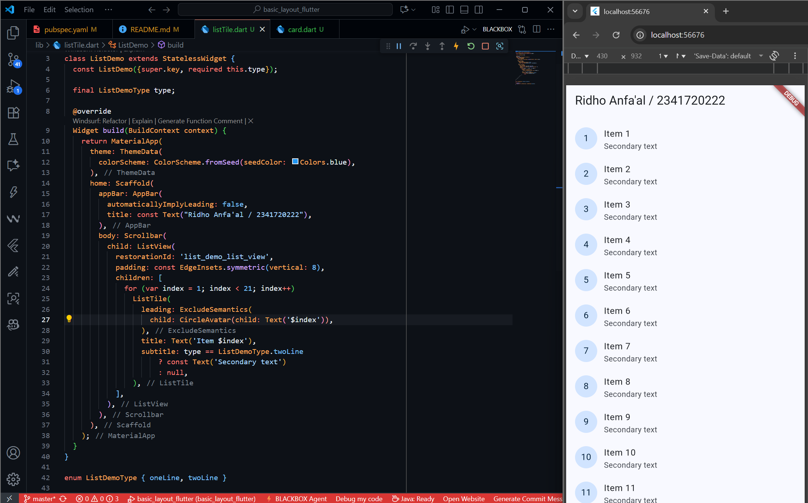

# Layouts in Flutter

## Layout a widget

- Standard apps
  

- Material apps
  

- Cupertino apps
  

## Lay out multiple widgets vertically and horizontally

## Common layout widgets

- Container
  

- GridView
  

- ListView
  

- Stack
  

- Card
  

- ListTile
  
