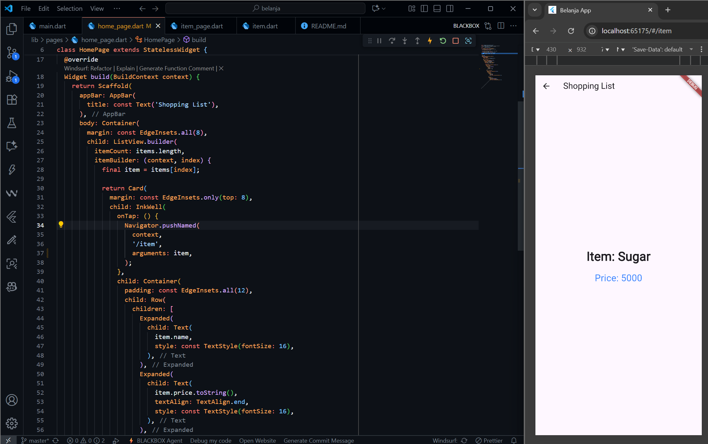
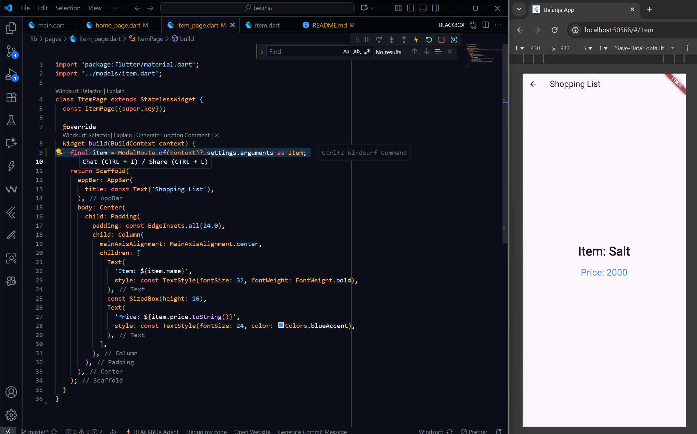
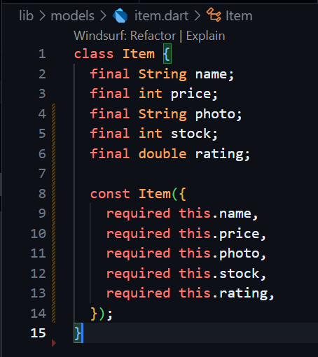
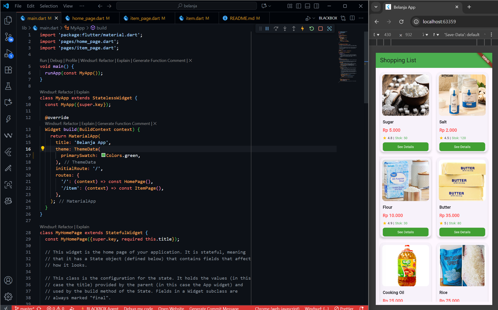
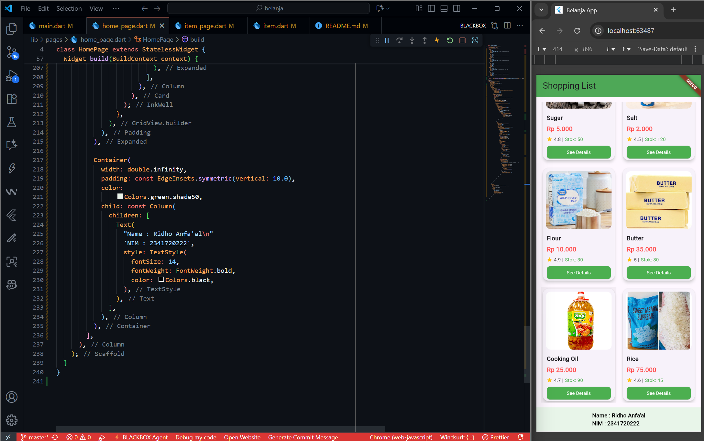
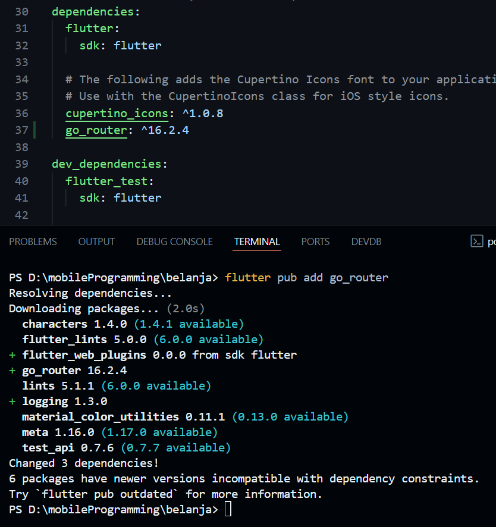

# PRACTICUM 5 : Building Navigation in Flutter

##

# PRACTICUM ASSIGNMENT 2
### 1. To send data to the next page, simply add arguments information to the usage Navigator. Update the code in the section Navigatorto look like this.

### 2. Reading the value passed on the previous page can be done using ModalRoute. Add the following code to the build function block in the page ItemPage. Once the value is retrieved, you can use it like any other variable. ( https://docs.flutter.dev/cookbook/navigation/navigate-with-arguments )

### 3. In the final version of your completed shoppingGridView app, add product photos, stock, and ratings. Change the appearance to resemble a typical marketplace app.

### 4. Please implement it Hero widgetin your shopping app by learning from this resource: https://docs.flutter.dev/cookbook/navigation/hero-animations

### 5. Customize and modify the appearance to create an attractive app. Additionally, break down widgets into smaller pieces of code. Add your name and student ID number to the footer of your shopping app .

### 6. Complete Practical 5: Navigation and Routes. Try modifying it using the go_router plugin , then document and push it to your repository in the form of screenshots of each work result along with explanations in the file README.md.. Submit the commit link for your GitHub repository to the agreed-upon lecturer!
- Installing go_router 

- Result :
