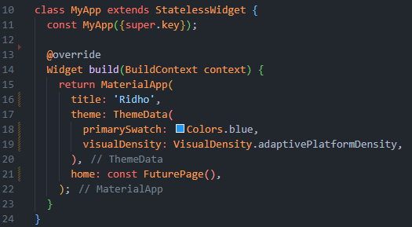
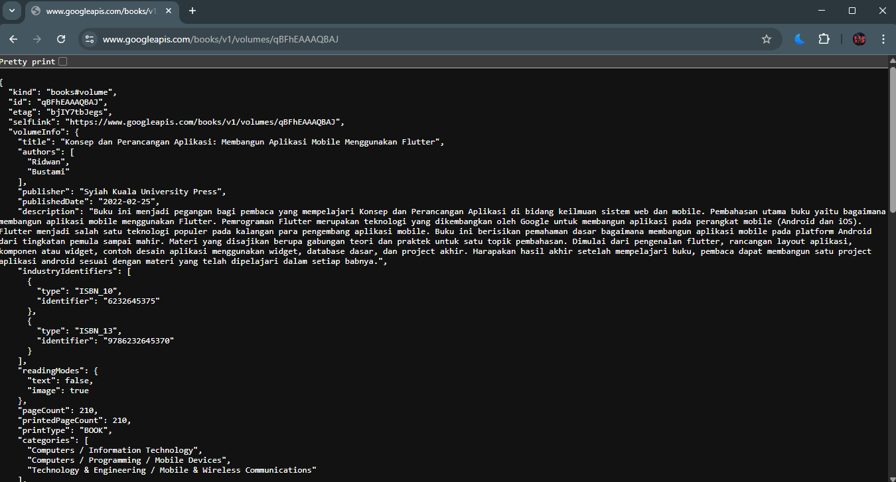
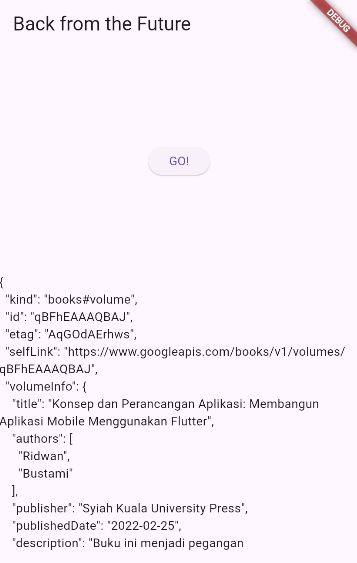
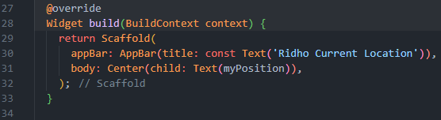
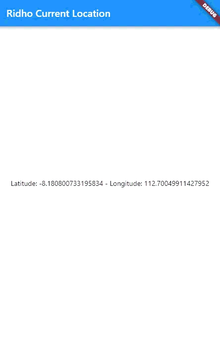
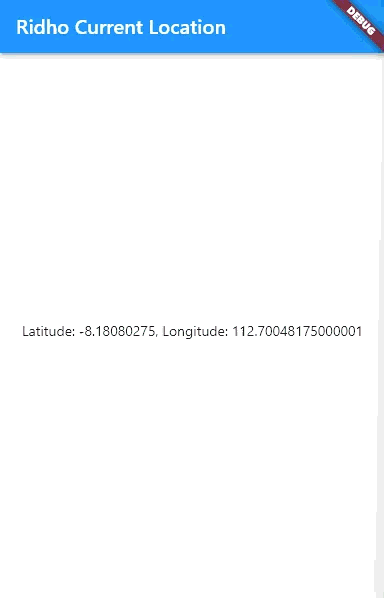
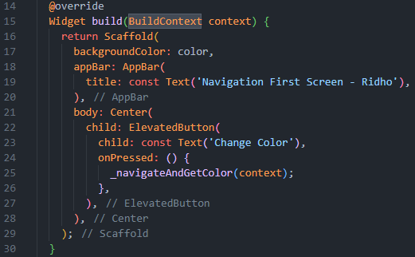
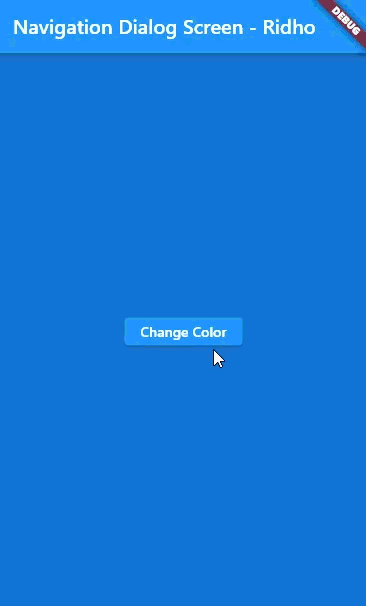

# Asynchronous Programming - Codelab 11

Ridho Anfa'al_2341720222_TI-3I

## Lab 1
### Question 1
Add your nickname to titlethe app as an identity for your work.

##

### Question 2
Search for your favorite book title in Google Books, then replace the book ID with the variable pathin the code. To do this, simply access the URL in your browser, as shown in the image below. Then, try accessing the complete URI in a browser like this. If it displays JSON data, you've succeeded. Capture your output and write it in READMEyour lab report. Then, commit the file with the message " W11: Question 2. "

##

### Question 3
Explain the meaning of the code in step 5 and related to substringit catchError!

The ElevatedButton's logic manages a data request lifecycle. Upon pressing the button, the getData() function is invoked, handling the resulting Future with .then() for success and .catchError() for failures. The success callback uses substring(0, 450) to truncate the response to prevent UI issues from excessive data. In case of an error, the catchError block updates the result variable with 'An error occurred' to prevent application crashes. setState() is called in both cases to refresh the user interface.

Capture your lab results as a GIF and attach it to the README. Then, commit the project with the message " W11: Question 3. "

##

## Lab 2
### Question 4
Explain the meaning of the code steps 1 and 2!

In the _FuturePageState class, three asynchronous methods—returnOneAsync(), returnTwoAsync(), and returnThreeAsync()—are defined in Step 1. Each method returns an integer after a simulated delay of three seconds through the await Future.delayed command, which is a typical approach for simulating time-intensive operations without blocking the main application thread. Step 2 introduces the count() method, which orchestrates the execution of these methods in sequence. Each method is called using the await keyword, causing the function to pause until the respective Future completes. The returned integers are summed into a variable named total, which ultimately incurs a total waiting period of nine seconds. After all executions are complete, the setState() method is used to update the result variable and refresh the user interface with the final output string.

##

## Lab 3
### Question 5
Explain the meaning of the code in step 2!

The Completer variable is initialized after declaration but before access. The getNumber() method initializes the Completer, calls the calculate() method, and returns completer.future, allowing the UI to await a future value. The calculate() method, marked as async, includes a five-second delay using await Future.delayed. After this delay, completer.complete(42) fulfills the future, providing control over the value sent to the asynchronous listener.

Capture your lab results as a GIF and attach it to the README. Then, commit the project with the message " W11: Question 5. "

##

### Question 6
Explain the difference between the code for step 2 and steps 5-6!

Step 2 adopts a "happy path" approach, where the completer only signals successful completion through the completer.complete() method, neglecting error management which could lead to a permanent pending state in case of exceptions. Conversely, Steps 5–6 implement a defensive programming strategy, encapsulating the asynchronous logic within a try-catch block in the calculate() method to intercept exceptions. Instead of crashing the application, it uses the completer.completeError() method to signal failures. Additionally, the UI handling in the onPressed callback is improved by incorporating a .catchError() listener to ensure that the result variable is updated and the interface is refreshed via setState() regardless of the operation's success or failure.

Capture your lab results as a GIF and attach it to the README. Then, commit the project with the message " W11: Question 6. "

##

## Lab 4
### Question 7

##

### Question 8
Step 1 requires manual instantiation of a FutureGroup object and relies on the async package and multiple verbose method calls. In contrast, Step 4 streamlines the process by using the native Future.wait method, which allows a list of asynchronous operations to be passed to a single constructor, removing boilerplate code. Both methods enable parallel execution, yet Step 4 is more idiomatic in Dart, offering a cleaner way to synchronize multiple futures without extra dependencies.

##

## Lab 5
### Question 9

##

### Question 10
Call handleError()the method in ElevatedButton, then run it. What is the result? Explain the difference between the code in steps 1 and 4!

##

## Lab 6
### Question 11

##

### Question 12

Do you get GPS coordinates when running in a browser? Why is that?

Yes, GPS coordinates can be obtained in a web browser through the HTML5 Geolocation API. Browsers determine location using a mix of IP address, nearby Wi-Fi, and Bluetooth data, rather than relying solely on a GPS chip. User permission is required to access this data, if the user denies it or if the site is not secure (HTTPS), coordinates cannot be retrieved.

##

## Lab 7
### Question 13
Is there a difference between the UI and the previous practicum? Why is that?

No, there is no visible difference in the user interface (UI) for the end-user. In both versions, the screen displays a CircularProgressIndicator during the loading phase and then transitions to displaying the GPS coordinates as text.

##

### Question 14
Is there any difference in the UI compared to the previous step? Why is that?

No visible difference appears in the UI when the code runs successfully because, under typical conditions, the code executes the success path with snapshot.hasError as false, returning the same Text(snapshot.data.toString()) widget.

##

## Lab 8
### Question 15
Add your nickname to each property titleas your job identity.

##

### Question 16

##

## Lab 9
### Question 17

