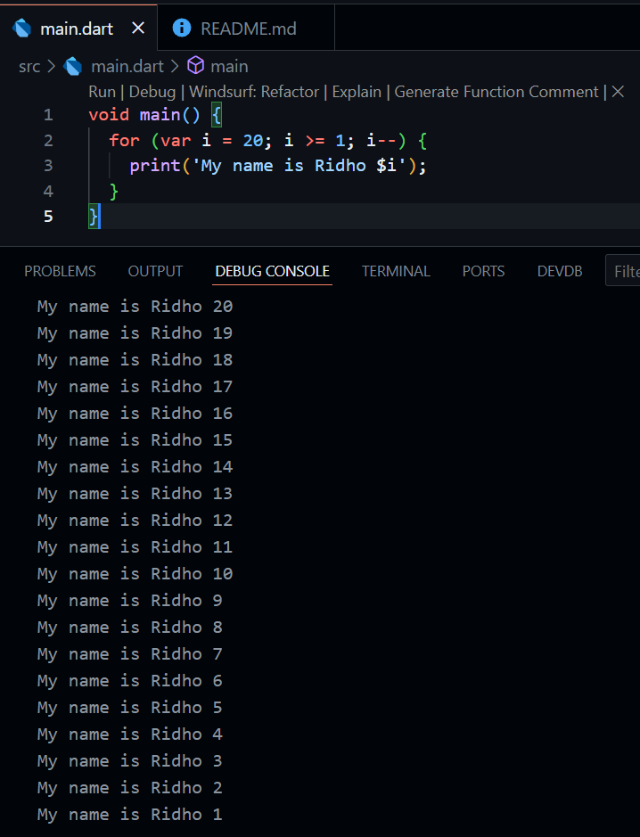
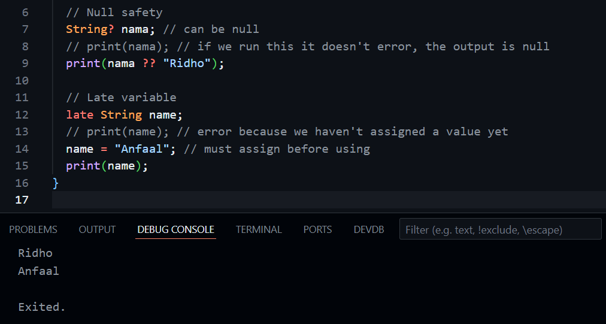

# Practical Assignment

### 1. Modify the code in line 3 in VS Code or your favorite code editor below to get the requested output!

### 2. Why is it so important to understand the Dart programming language before we use the Flutter framework? Explain!
Because dart is the language of flutter, while flutter provides the tools for building UI and managing app state, it's dart that powers everything under the hood. Therefore learning dart first allows us to understand why flutter works the way it does.

### 3. Summarize the material from this codelab into key points that you can use to help you develop mobile applications using the Flutter framework.
1. Dart for flutter
    - Flutter as framework for dart enhances developer app creation.
    - Understanding dart concepts first is essential for comfortable experimentation and knowledge expansion within flutter.
2.  How dart code executes
    - Dart code can be executed in 2 primary ways :
        - Dart virtual machines : Used for command line execution and during mobile development for features like debugging and hot reload.
        - JavaScript Compilation: Translates Dart code into JavaScript for web deployment.
    - Dart code execution involves runtime systems, core libraries, and garbage collectors. It can operate in two modes:
        - Just-In-Time (JIT) Compilation: Compiles code as needed. This mode is used for development, enabling features like hot reload and debugging.
        - Ahead-Of-Time (AOT) Compilation: Compiles code beforehand for production. This yields significant performance gains but lacks hot reload and advanced debugging.

### 4. Provide an explanation and code examples about the differences between Null Safety and Late variables!

- Null safety feature makes us explicitly declare if a variable can be null (using ?) or if it must always have a value. This prevents unexpected errors from trying to use a variable that has no value.

- The late keyword is used for non nullable variables that we can't initialize right away. It's a promise that we will assign them a value before you try to read from them, preventing errors that would occur if we tried to use an uninitialized non nullable variable.