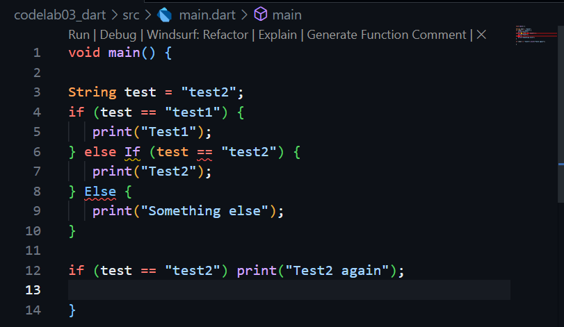
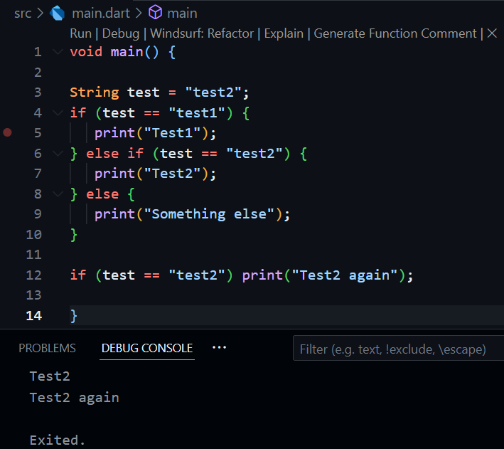
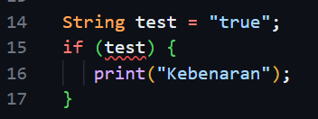
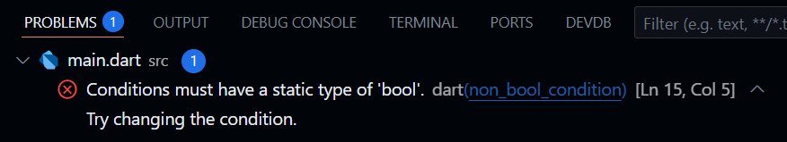
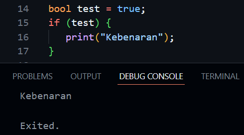

# Practical Assignments
1. Please complete Practicals 1 to 3, then document the results of your work with a screenshot and explanation!
   #### Practical 1 : Implementing Control Flows ("if/else)
    - Step 1 : Type or copy the following program code into the function main().
    

    - Step 2 : Please try executing the code in step 1. What happens? Explain!
    
    When the code is executed there are 2 errors because of incorrect keywords (else If & Else), else if and else must be written in lowerccase. Here's the correct one :
    

    - Step 3 : Add the following program code, then try executing (Run) your code.
    
        
        What happened? If an error occurs, please correct it but continue using if/else.
        There is an error :
        
        It's because the test variable is a string as the condition, dart doesn't know how to interpret the string "true" as a boolean true automatically. It sees a string and expects a true/false value. This mismatch causes the error. Here's the correct one :
        

    #### Practical 2 : Implementing "while" and "do-while" Loops
    - Step 1 : 

2. Create a program that displays prime numbers from 0 to 201 using Dart. When a prime number is found, display your full name and student ID number.