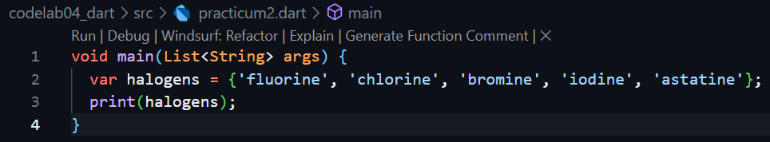

# Practical Assignments

## 1. Please complete Practicals 1 to 5, then document your work with screenshots and explanations!

### Practical 1 : List Data Type Experiment
### Step 1 
- Type or copy the following program code into the function main().
    
    

### Step 2
- Please try executing the code in step 1. What happens? Explain!
    
    

    The code create a list [1,2,3], assert is used to check conditions, it doesn't print anything unless the condition is false. The program prints the length = 3, it prints the element at index 1 = 2, then it changes the element at index 1 from 2 to 1, and it prints the new value = 1.

### Step 3 
- Add the following program code, then try executing (Run) your code.
    
    

### Practical 2 : Data Set Type Experiment
### Step 1
- Type or copy the following program code into the function main().

    

### Step 2
- Please try running the code in step 1. What happens? Explain! Then, correct any errors.

    
    
    That code created a set in dart. In dart curly braces {} with values create a set, a set is a collection of unique items no duplicates. When we print a set dart will display it inside {} braces with elements separated by commas.

### Step 3
- Add the following program code, then try to execute (Run) your code.

    

    The ouput looked weird because, when we declared var names3 = {}; the dart infers it as a map not a set.

- What happened? If an error occurs, please correct it but keep the three variables. Add your name and student ID to both Set variables using two different functions: .add()and .addAll(). Remove the Map variable; we'll try that in the next lab.

    

    .add() function is to adds one element to a set, while .addAll() adds multiple elements at once.

### Practical 3 : Maps Data Type Experiment
### Step 1
- Type or copy the following program code into the function main()

    

### Step 2
- Please try executing (Run) the code in step 1 above. What happened? Explain! Then fix it if an error occurs.

    

    var gifts and var nobleGases are maps in dart, a map stores key value pairs, key are like labels and value are the data connected to those labels. gifts map keys are strings ('first', 'second', 'fifth') value are mixed types ('partridge' 'turtledoves', 1). nobleGases map keys are integer integers (2, 10, 18) values are also mixed: strings ('helium', 'neon') and an integer (2).

### Step 3
- Add the following program code, then try to execute (Run) your code.

    

    Those problems happens because the program created mhs1 and mhs2 maps but we never stored anything in them or printed them, dart warns that they are unused.

- Add your name and student ID elements to each of the variables above ( gifts, nobleGases, mhs1, and mhs2). Document the results and create a report! 

    
    

### Practical 4 : List Data Type Experiment: Spread and Control-flow Operators
### Step 1
- Type or copy the following program code into the function main().

    

### Step 2
- Please try running the code in step 1. What happens? Explain! Then, correct any errors.

    

    The error happens because the program trying to print list1 but since list1 was never defined, dart throws an undefined name error. It can be solve like this :

    

### Step 3
- Add the following program code, then try executing (Run) your code.

    

    The problems happens because when we first created list1 dart inferred its type as List<int>, that means it can only contain integers not null, so when we tried to insert null dart complained. Here's the correct one :

    

    var list1 = [1, 2, 3]; meaning the list can only store integers, null is not allowed because int is non nullable by default. Therefore I used var list1 = <int?>, it means list1 now can be either int or null.

- Add variable list containing NIM and use Spread Operators. Document results and create reports!

    

### Step 4
- Add the following code to the program, then try executing (Run) the following code.

    

    The error happens because variable promoActive is used but we never declared it.

- What happened? If error occurs, please correct. Show result if variable promoActive when truegiven false.

    promoActive = true

    

    promoActive = false

    

### Step 5
- Add the following code to the program, then try executing (Run) the following code.

    

    The error happens because variable login is used but we never declared it.

- What happened? If error occurs, please correct. Show results if the variable loginhas other conditions.

    login = manager : 

    

    login = admin :

    

### Step 6
- Add the following code to the program, then try executing (Run) the following code.

    

### Practical 5 : Experiment Type Data Records
### Step 1
- Click or type the code in the following functions main().
    

### Step 2
### Step 3
### Step 4
### Step 5