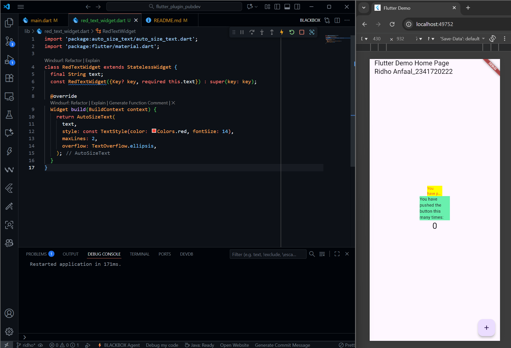

# Practicum Assignments 
## 1. Complete the practicum, then document and push it to your repository in the form of a screenshot of the work results along with an explanation in the file README.md!

- The RedTextWidget (AutoSizeText) handles text overflow issues by automatically reducing font size when the text does not fit within a narrow width of 50 pixels. The Standard Text Widget (main.dart) fails to do this due to its default font size. The application still functions as a standard Flutter counter application, with the _incrementCounter function triggering setState() to update the Text widget. This practical demonstration highlights the importance of third-party plugins like AutoSizeText in addressing common layout issues and ensuring app layout remains clean and responsive, especially on small screens or with specific widget size constraints.

##

## 2. Explain the purpose of step 2 in the practicum!
- The main purpose of Step 2 is to integrate third-party (external) code into your Flutter project. Specifically: 
    1. Dependency Management: The command automatically adds auto_size_text: ^[version] to the dependencies section in the pubspec.yaml file. This tells Flutter that the project requires this package to function.
    2. Fetching Code: This command runs flutter pub get behind the scenes, which downloads the auto_size_text plugin code from Pub.dev and makes it available in the local cache so that it can be imported and used in your code.

##

## 3. Explain the purpose of step 5 in the practicum!
- The goal of Step 5 is to make the RedTextWidget dynamic and reusable by accepting external data.
    1. RedTextWidget can now accept different text each time it is called, rather than just static text.
    2. Since RedTextWidget is a StatelessWidget, the text variable is defined as final. This ensures that the data will not change after the widget is created.
    3. Required Parameter: Using required this.text forces users of this widget to provide a text value, preventing bugs where the widget is displayed without the required data.

##

## 4. In step 6 there are two widgets added, explain their functions and differences!
- 

##

## 5. Explain the meaning of each parameter in the plugin based on the links in thisauto_size_text documentation !