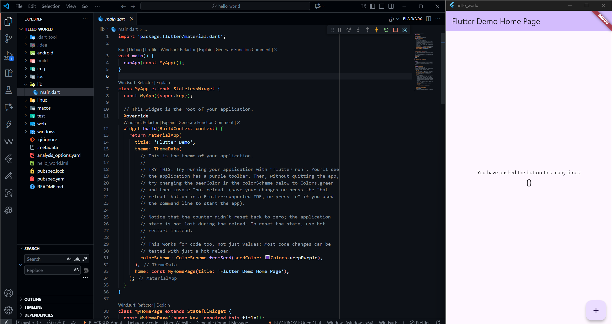
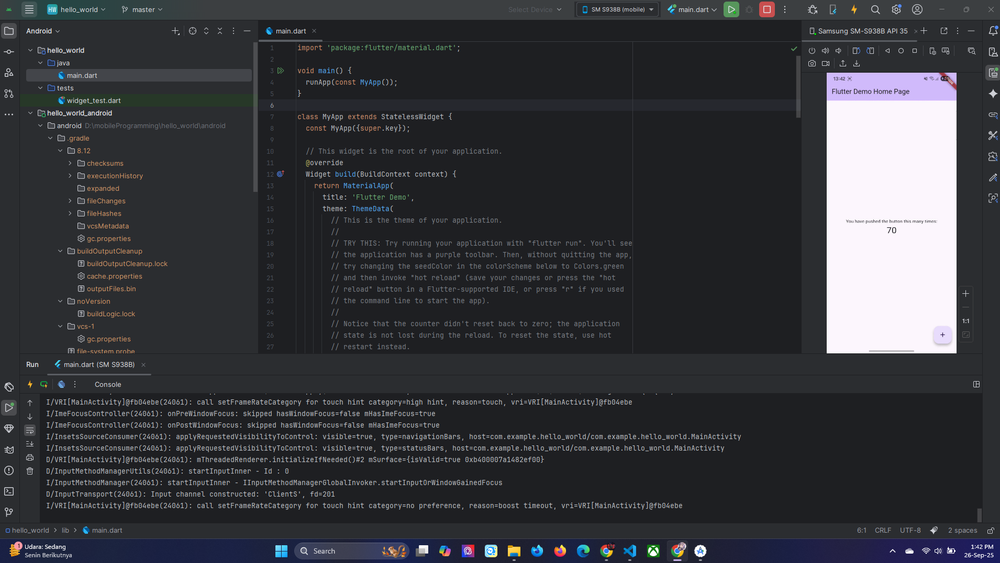
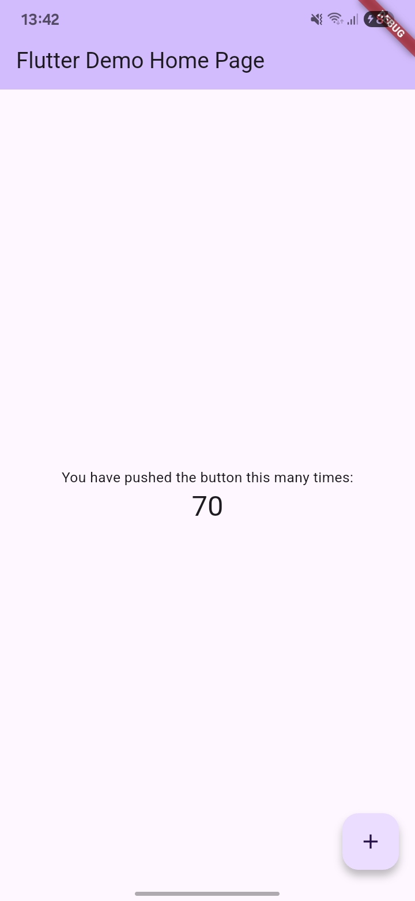
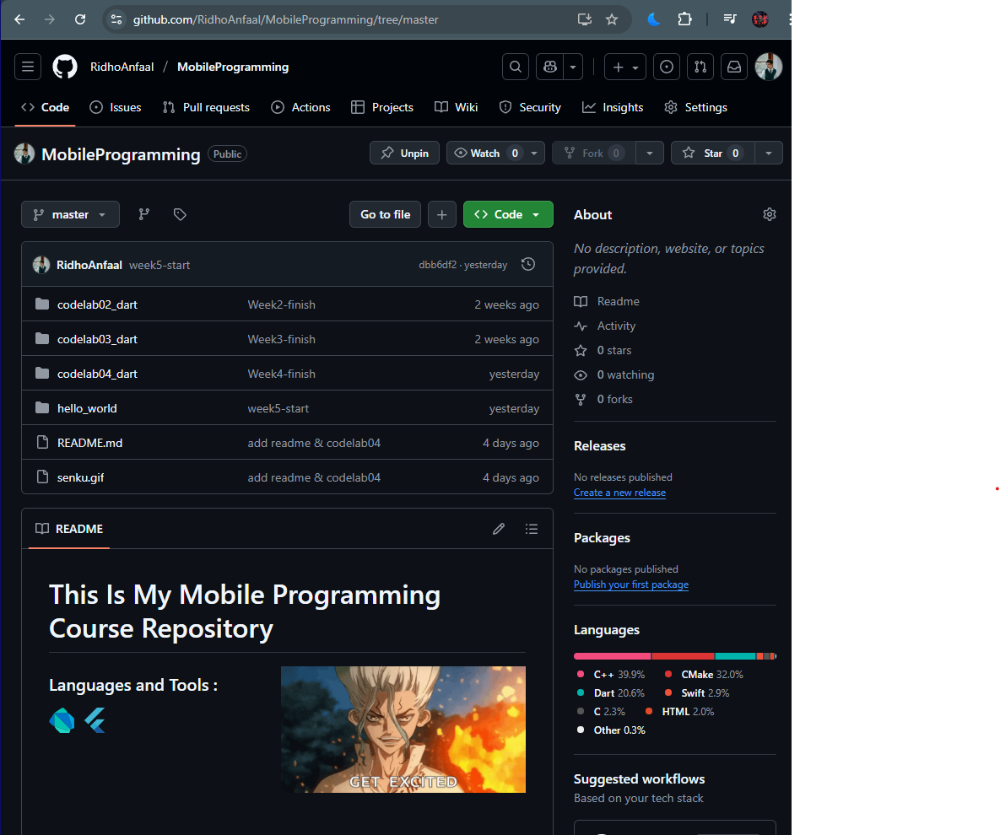

# Practicum Assignment

## 1. Complete Practicals 1 to 5, then document and push them to your repository in the form of screenshots of each work result along with an explanation in the file README.md!

### Practicum 1 : Creating a New Flutter Project

### Practicum 2 : Connecting an Android Device or Emulator
From android studio :

From mobile phone :

### Practicum 3 : Creating a GitHub Repository and Practical Report

### Practicum 4 : Implementing Basic Widgets
