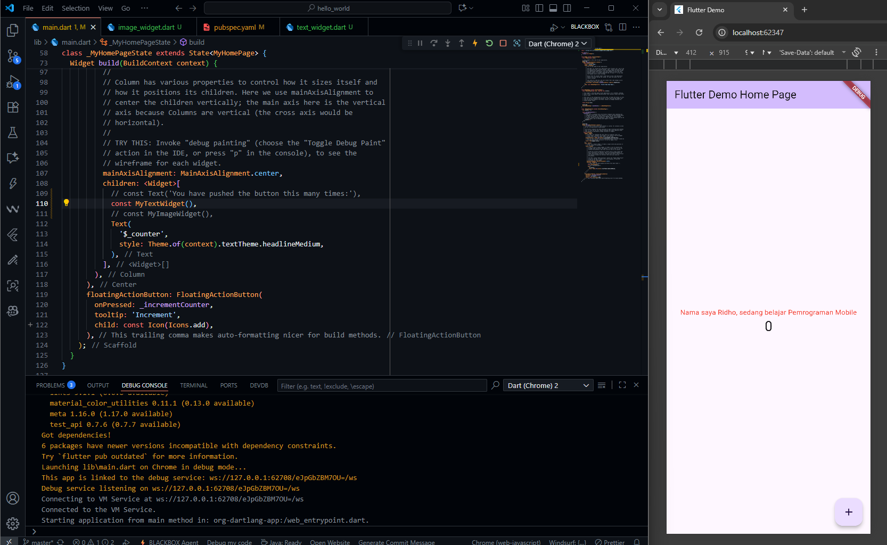

# Practicum Assignment

## 1. Complete Practicals 1 to 5, then document and push them to your repository in the form of screenshots of each work result along with an explanation in the file README.md!

### Practicum 1 : Creating a New Flutter Project

- The process of creating a new Flutter project begins by opening the Command Palette in VS Code (usually by pressing Ctrl + Shift + P) and selecting the Flutter: New Application Project option. Users must then select an appropriate folder location for their project. The next crucial step is to give the project a name, which must be all lowercase and use an underscore (_) as a separator, such as hello_world. Once the project name has been entered and Enter has been pressed, VS Code will automatically complete the project structure creation process. The success of the process is indicated by a confirmation message stating that the Flutter project is ready.

### Practicum 2 : Connecting an Android Device or Emulator
From android studio :

- Android application development on physical devices can be done flexibly through Android Studio, either with a USB cable connection or wirelessly via Wi-Fi (using a QR code or 6-digit code).

### Practicum 3 : Creating a GitHub Repository and Practical Report

### Practicum 4 : Implementing Basic Widgets

- This lab focuses on the basic steps of implementing widgets in the previously created Flutter hello_world project, covering two main types of widgets: Text Widget and Image Widget. The process involves creating a basic_widgets subfolder in lib for modularity, defining a custom text display in text_widget.dart, and then adding an image (logo_polinema.jpg) as an asset. To display the image, the pubspec.yaml must be configured so that Flutter recognizes the assets directory, and the Image.asset() code is used in image_widget.dart and integrated into main.dart, showing how Flutter applications can display dynamic and static data.

### Practicum 5 : Implementing Material Design Widgets and iOS Cupertino

- This practice demonstrates cross-platform design: first, the use of Material Design widgets (Scaffold, FloatingActionButton, AlertDialog, TextField) to create a complete Android/generic experience, from basic layouts to user interactions such as counters and text input. Second, the demonstration of Cupertino widgets (CupertinoButton, CupertinoActivityIndicator) shows how Flutter can deliver iOS-specific design elements. 

## 2. Complete Lab 2, and you'll be required to run the hello_world app on a physical device (Android/iOS) to gain experience connecting to a physical device. Capture the results of the app on the device, then create a lab report in a README.md.
From android studio :

From mobile phone :

## 3. In practical 5, starting from Steps 3 to 6, create a separate widget file in the folder basic_widgets, then in the file main.dart, simply import the widget according to each step!

## 4. Complete Codelabs: Your first Flutter app , then create a lab report and push it to your GitHub repository!
GitHub link : https://github.com/RidhoAnfaal/MobileProgramming/tree/master/codelab05_app