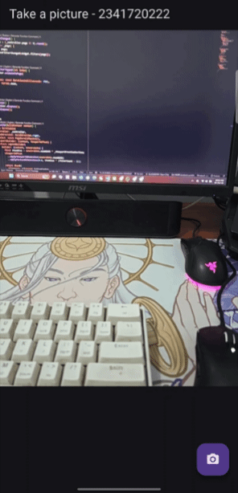

# CODELAB 09

TI-3I_Ridho Anfa'al_2341720222

## Practicum Assignments

## 1. Complete Practicals 1 and 2, then document and upload screenshots of each work result along with explanations in a file README.md! If there are any errors or code that doesn't work, please correct them according to the application's purpose!

### Practicum 1 : Taking Photos with the Camera in Flutter

- In this practicum 1 I've created application to access and use the device's camera. The camera initialized using availableCameras(), and created screens for taking pictures and another for displaying the captured image. The asycn and await keywords were used to ensure that the camera loaded properly before being used.

### Practicum 2 : Creating a photo filter carousel

- In this practicum 2 I've created photo filter feature using a carousel interface, several widgets such as filterSelector, FilterItem, and FilterCarousel were develop to allow color filters to be applied to an image. The widget state and color blending  change the photo's appearance dynamically.

##

## 2. Combine the results of lab 1 with the results of lab 2 so that after taking the photo, you can create a carousel filter!

##

## 3. Explain the purpose void async of practical 1?
void main() async function is used to allowing the app to perform time consuming tasks without freezing. In practicum 1 it's needed because the camerea initialization takes time to load, using async and await ensures that camera hardware is fully ready before the app starts running.

##

## 4. Explain the function of annotation @immutable and @override?
- @immutable annotation marks a class so that its properties can't change after the object is created. This helps prevent unexpected behavior since any data change requires creating a new widget instead of modifying the existing one.

- @override is used when a subclass replaces or modifies a method from its parent clas. It helps make the code clearer and prevents mistakes by ensuring that the overridden method actually exists in the superclass.