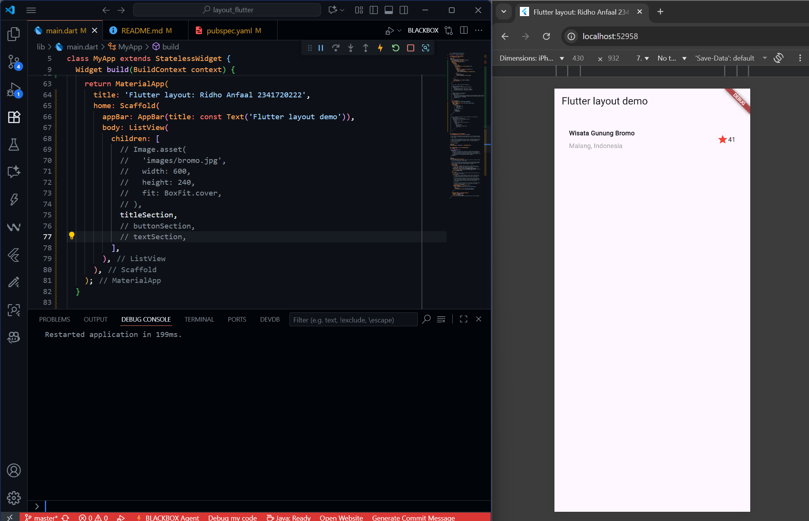
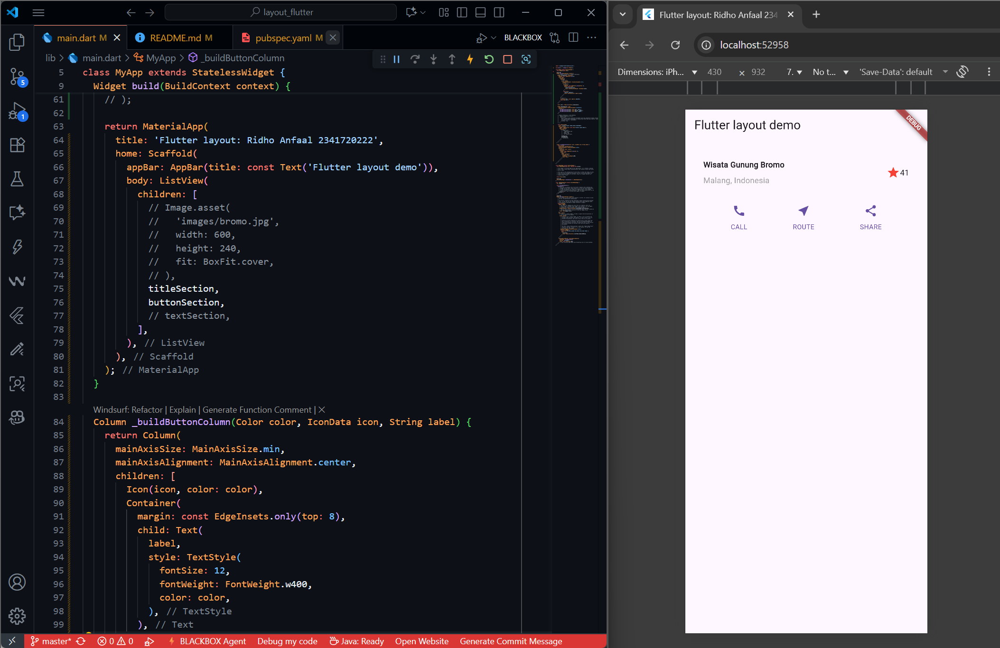
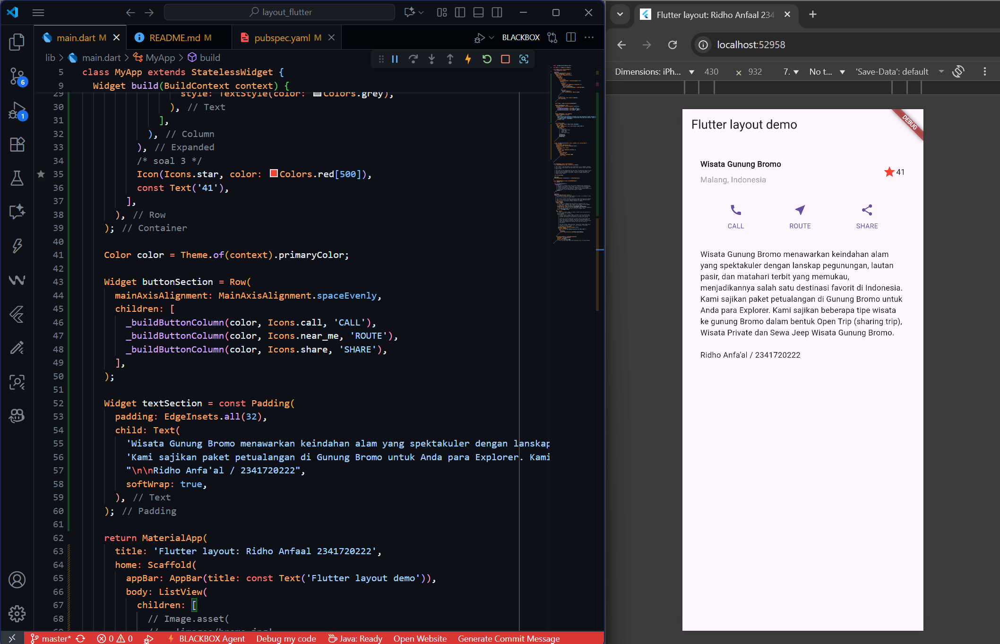
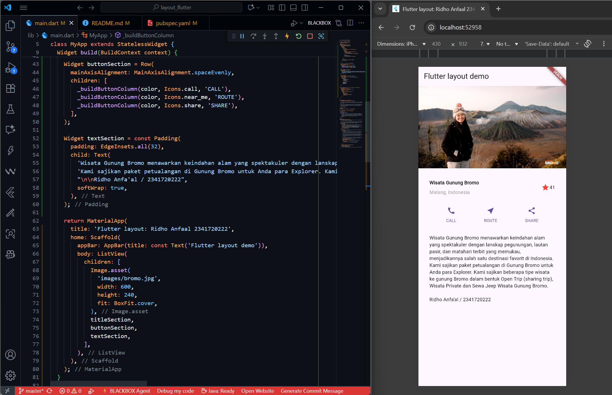

# PRACTICUM ASSIGNMENT 1

## 1. Complete Practicals 1 to 4, then document and push them to your repository in the form of screenshots of each work result along with an explanation in the file README.md!

### Practicum 1 : Building a Layout in Flutter

- This practicum explored Flutter's layout system, learning to arrange widgets using row, column, and expanded. Combining various UI sections to create a structured layout. The row widget aligned items horizontally, while column managed vertical alignment, showcasing Flutter's flexibility. The expanded widget adjusted content to available space.

### Practicum 2 : Implementation of button row

- This practicum implemented a button row in Flutter by creating a reusable widget structure to display multiple horizontally arranged buttons with icons and labels. A private method, \_buildButtonColumn(), constructs a column widget with an icon and a text widget, promoting code reuse. Then designed the buttonSection widget using a row to align three button columns evenly. The styling employed Flutter’s primary color for a consistent look.

### Practicum 3 : Implementation of text section

- This practicum implement a text section in Flutter using a widget variable called textSection, which utilizes a padding widget for spacing. The text widget within displays a paragraph about the "Wisata Gunung Bromo" tourist destination, with the softWrap: true property ensuring text readability on various screen sizes.

### Practicum 4 : Implementation of image section

- This practicum I learned to implement an image section in a Flutter layout. Prepared image assets by creating an images folder and declaring the image path in the pubspec.yaml file. The image was added using the Image.asset() widget, with parameters like width, height, and fit: BoxFit.cover to ensure a distortion-free, appealing layout. Lastly all components were placed inside a ListView widget to allow for a scrollable interface, ensuring accessibility on smaller screens. This activity provided practical experience in managing assets, displaying images, and structuring responsive layouts in Flutter.

## 2. Please implement it in a new project " basic_layout_flutter " by accessing this source: https://docs.flutter.dev/codelabs/layout-basics

- Flutter project link : https://github.com/RidhoAnfaal/MobileProgramming/tree/master/basic_layout_flutter

### Practicum 5 : Building Navigation in Flutter
- Flutter project link for this practicum : 

# PRACTICUM ASSIGNMENT 2
- Link for assignment 2 : 