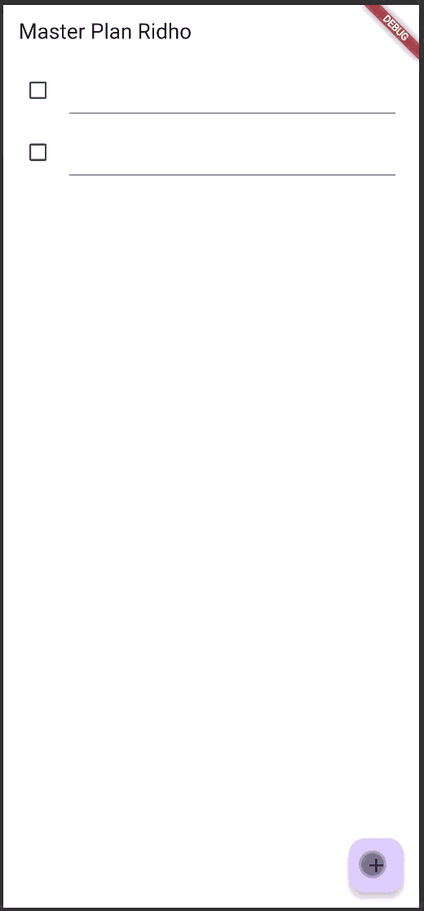
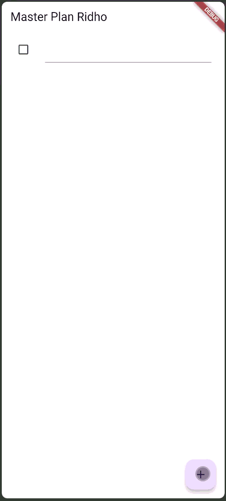
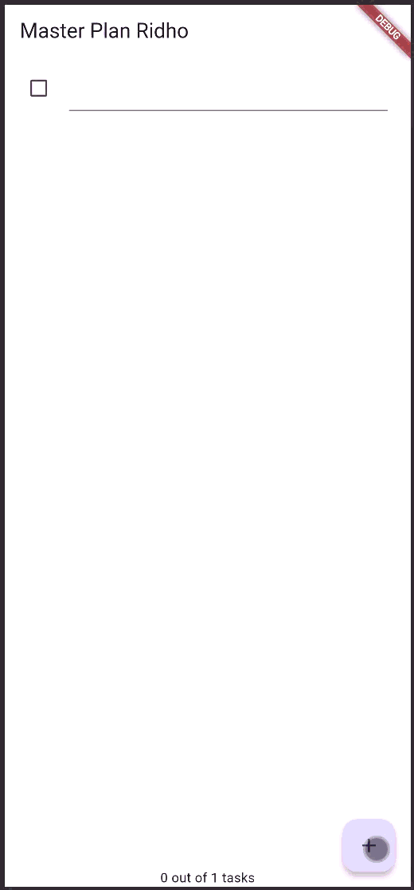

# CODELAB 10

Ridho Anfa'al_2341720222

## Pacticum Assignment 1 : Basic State with Model-View

### 1. Complete the lab steps, then document the final results with a GIF and explanation in the file README.md! If you find any errors or issues, please fix them.

##

### 2. Explain the purpose of step 4 in the practicum! Why is this done?
This step is used to make a data_layer.dart that only contains export statements, this makes importing easier. Instead of importing task.dart and plan.dart separately we only need to import one file data_layer.dart.

##

### 3. Why is the plan variable needed in step 6 of the lab? Why is it a constant?
Plan variable is needed to store the main data/state of all tasks that will appear on the screen. Since the tasks can change this data must be inside state so that UI can update when using setState()

##

### 4. Capture the results of Step 9 as a GIF, then explain what you have created!

This step creates a listTile for each task, each task will have : 
 - a checkbox to mark whteher the task is complete or not
 - a textformfield to type/edit the task description

When user type or click checkbox flutter updates the plan list using setState() and the UI changes instanly.

##

### 5. What is the use of the methods in Steps 11 and 13 in the lifecycle state ?
- initState() : runs when screen first created and to initialize scrollController and add listener for auto hide keyboard when scrolling.

- dispose() : runs when screen is closed/removed and to destroy scrollController to avoid memory leaks.

In short : step 11 prepare controller at begining and step 13 clean controller when done.

##

## Pacticum Assignment 2 : InheritedWidget

### 1. Complete the lab steps, then document the final results with a GIF and explanation in the file README.md! If you find any errors or issues, please correct them according to the application's purpose.

##

### 2. Explain what is meant InheritedWidget by step 1! Why is it used InheritedNotifier?
InheritedWidget is a widget that allows data/state to be shared down the widget tree so the child widgets can access that data without needing to pass parameters manually. The InheritedWidget in this step is the PlanProvider class, this widget is used to place the Plan model data inside the widget tree so other widgets under it can access the same data.

##

### 3. Explain the purpose of the method in step 3 of the practicum! Why is this done?
The methods completedCount and completenessMessage are used to calculate how many tasks are completed and show the progress message. This is done to keep logic inside the model, not inside the UI. By doing this, the code becomes cleaner, easier to manage, and the UI only needs to display the result from the model.

##

### 4. Capture the results of Step 9 as a GIF, then explain what you have created!

The tasks data is stored using InheritedNotifier, not inside the widget state anymore. The progress 0 out of 1 tasks is displayed at the bottom. When the add button is pressed, a new task can be added and the UI updates automatically because the data is handled using ValueNotifier + InheritedNotifier.

##

