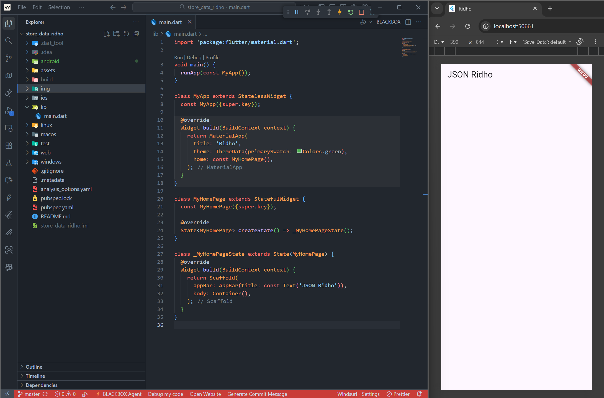
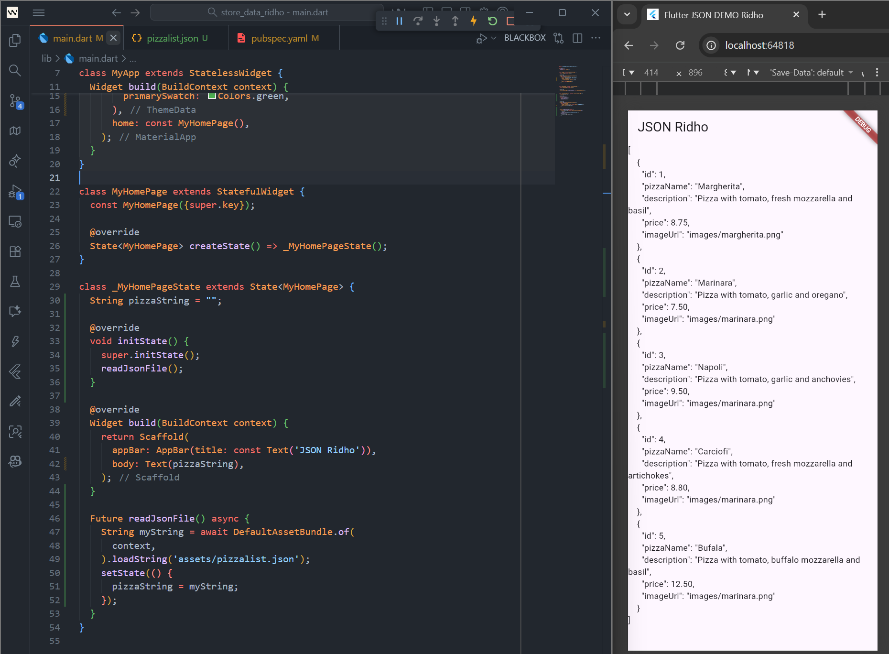
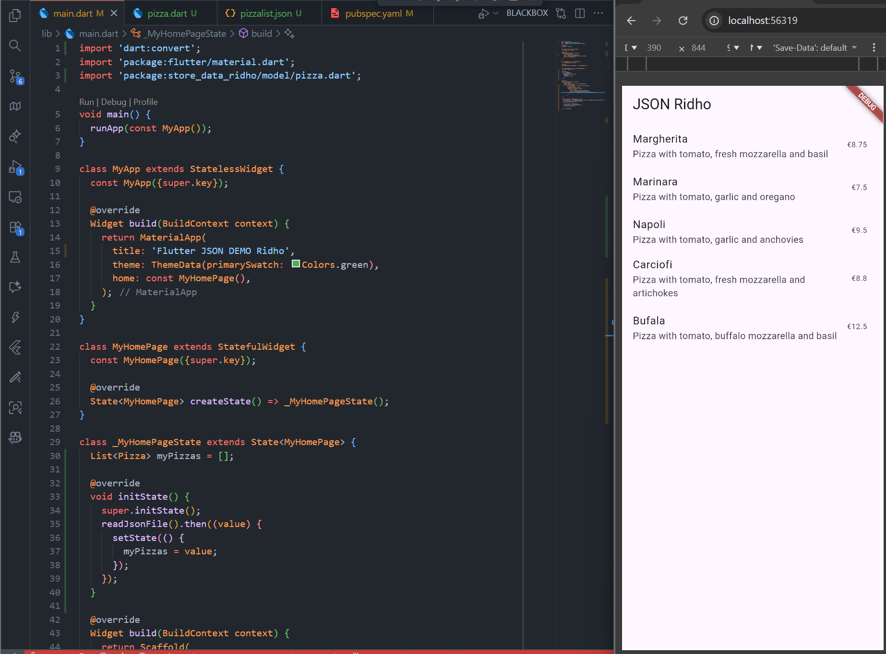
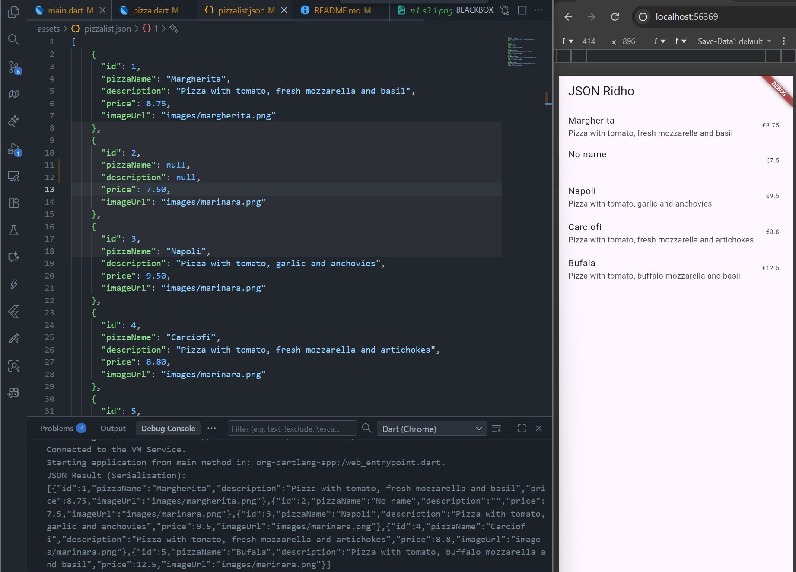
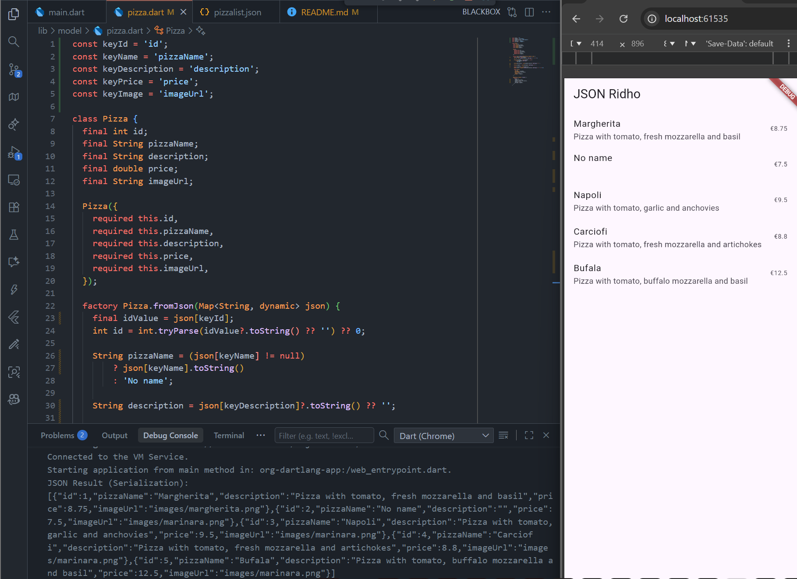
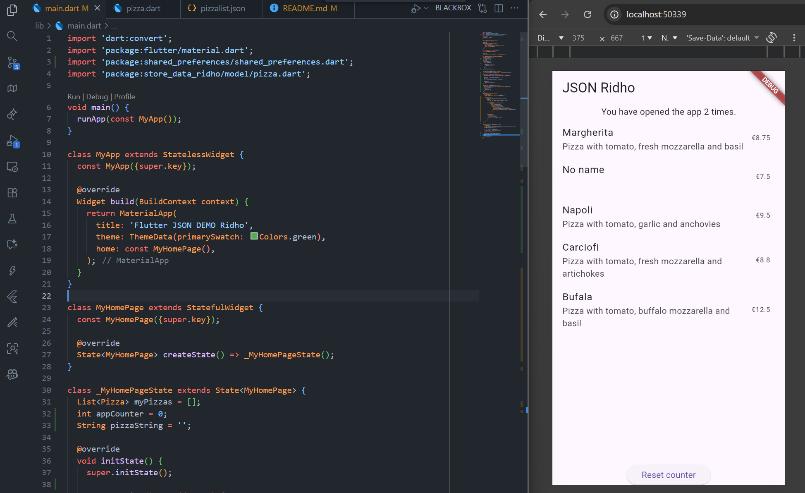
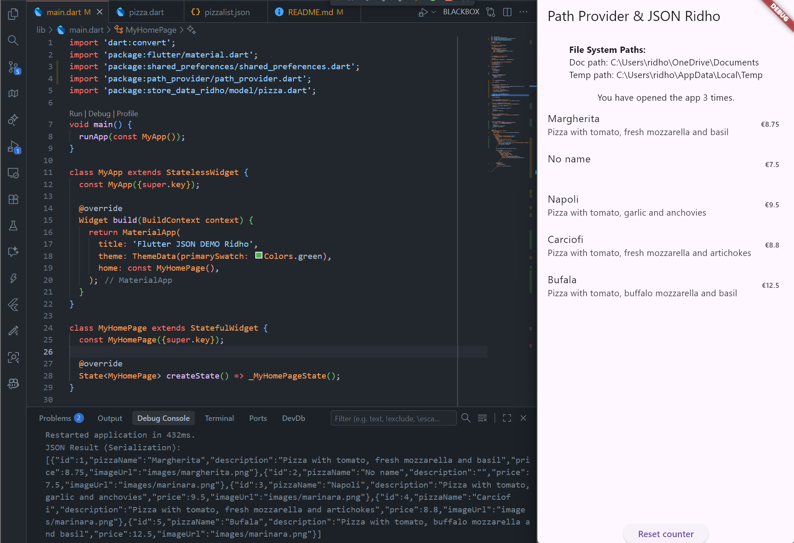
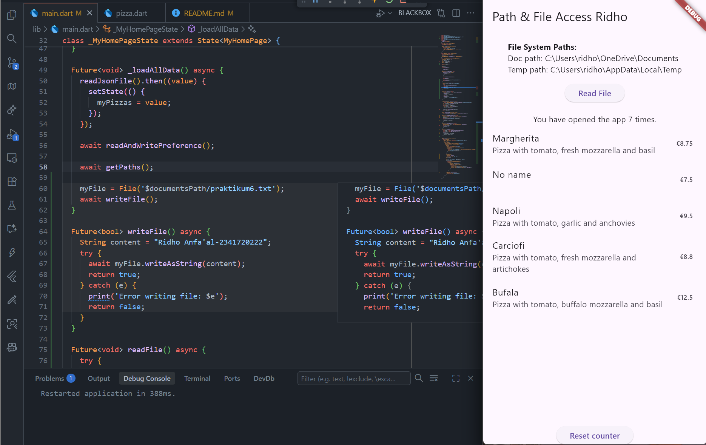
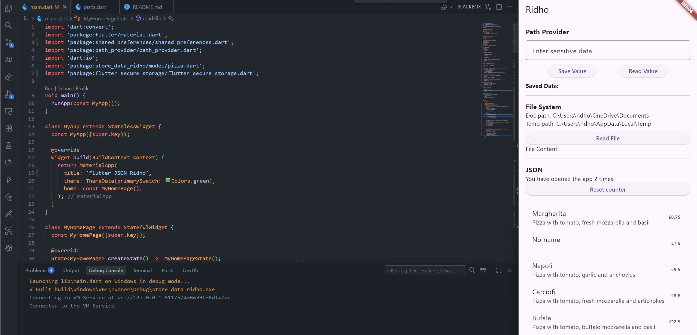

# Codelab 13

Ridho Anfa'al_2341720222

## Lab 1
### Question 1

### Question 2

### Question 3

## Lab 2
### Question 4

## Lab 3
### Question 5

This code improves safety by minimizing runtime errors from JSON key typos, catching such errors as compile errors instead of runtime crashes. It enhances maintainability through centralized updates, allowing changes to key names in a single line of declaration, ensuring all references to the constant are updated consistently, thus reducing time and risk of errors during future refactoring.

## Lab 4
### Question 6

## Lab 5
### Question 7

## Lab 6
### Question 8

The writeFile() function is an asynchronous method to save a Full Name and Student ID to a text file in the application's document directory. It is called once during initialization after establishing the document path and creating the file object. The writing process uses await myFile.writeAsString(content); to handle I/O operations and ensure completion before proceeding. A try-catch block manages errors, returning true for a successful write and false if errors occur, with error messages displayed. The content can later be accessed via the ‘Read File’ button, activating the readFile() function.

## Lab 7
### Question 9

##

# Codelab 13

## Lab 1
### Question 1
