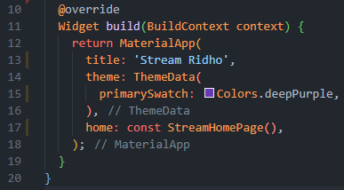
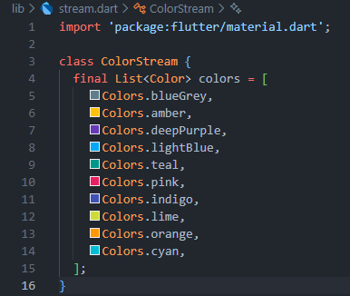

# Codelab 12 | Advanced State Management with Streams

Ridho Anfa'al_2341720222_TI-3I

## Lab 1
### Question 1
Add your nickname to titlethe app as an identity for your work.

##

### Question 2

##

### Question 3
Explain the function of the keywords yield*in the code!

- The yield* keyword in an async* generator delegates value production to another stream, emitting every value from the provided stream as its own, effectively "piping" values from Stream.periodic into the getColors() stream.

What does the content of the code command mean?

- The code establishes an infinite color cycle by utilizing a stream that emits a color every second. It creates a periodic stream that counts elapsed seconds, using the modulo operator to loop through a list of colors. This ensures that once the counter surpasses the number of colors, it resets to the start, allowing continuous color output. The selected color is returned based on the calculated index.

##

### Question 4 

##

### Question 5
Explain the difference between using listenand await for(step 9)!

The main difference between .listen() and await for in stream management is their approach to program flow and stream lifecycle. The .listen() method is non-blocking, allowing code execution to continue while creating a StreamSubscription object, ideal for long-running streams. In contrast, await for is sequential and blocking, creating an asynchronous loop that processes stream items until it closes, making it more suitable for simple logic in processing every item in a stream.