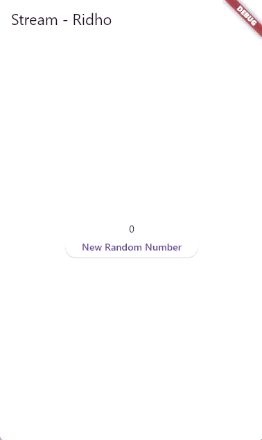
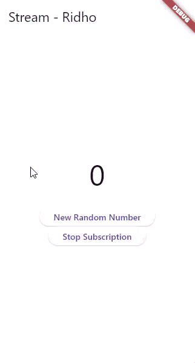

# Codelab 12 | Advanced State Management with Streams

Ridho Anfa'al_2341720222_TI-3I

## Lab 1
### Question 1
Add your nickname to titlethe app as an identity for your work.

##

### Question 2

##

### Question 3
Explain the function of the keywords yield*in the code!

- The yield* keyword in an async* generator delegates value production to another stream, emitting every value from the provided stream as its own, effectively "piping" values from Stream.periodic into the getColors() stream.

What does the content of the code command mean?

- The code establishes an infinite color cycle by utilizing a stream that emits a color every second. It creates a periodic stream that counts elapsed seconds, using the modulo operator to loop through a list of colors. This ensures that once the counter surpasses the number of colors, it resets to the start, allowing continuous color output. The selected color is returned based on the calculated index.

##

### Question 4 

##

### Question 5
Explain the difference between using listenand await for(step 9)!

The main difference between .listen() and await for in stream management is their approach to program flow and stream lifecycle. The .listen() method is non-blocking, allowing code execution to continue while creating a StreamSubscription object, ideal for long-running streams. In contrast, await for is sequential and blocking, creating an asynchronous loop that processes stream items until it closes, making it more suitable for simple logic in processing every item in a stream.

##

## Lab 2
### Question 6
Explain the meaning of the code steps 8 and 10!

Step 8 discusses initializing a Stream Listener in Flutter. The method initState() establishes the UI connection to monitor incoming data. It involves creating an instance of NumberStream, obtaining a reference to its controller, and subscribing to the stream to handle new data. The setState() function is used to update the UI with the latest number. Step 10 describes the addRandomNumber() method, which generates a random integer and pushes it into the StreamController's Sink, allowing the Stream to broadcast this number to the listener, ensuring the UI updates accordingly.

##

### Question 7
Explain the meaning of the code steps 13 to 15!

Step 13 involves adding the addError() method to the NumberStream class in stream.dart, allowing the stream to transport both data and errors. Step 14 updates the .listen() function in main.dart to include an onError parameter, enabling the app to execute a specific block of code when an error is received. LastNumber is set to -1 to visually signal a failure. Step 15 modifies the addRandomNumber() method to call numberStream.addError() for testing, ensuring the listener properly catches errors and updates the UI.

##

## Lab 3
### Question 8
Explain the meaning of the code steps 1-3!

In the explanation of transformer usage, Step 1 introduces the variable declaration StreamTransformer transformer, which acts as a processing unit to modify data in a stream, similar to how a water filter cleans water. Step 2 outlines the handleData logic, where the StreamTransformer.fromHandlers constructor intercepts incoming data (random numbers ranging from 0 to 9) and transforms it by multiplying the value by 10 before sending it to the output sink. Step 3 explains the use of the .transform() method, which integrates the transformer into the stream process, ensuring that the modified output (e.g., 10, 50, 80) is received by the listener instead of the original numbers (1, 5, 8).

##

## Lab 4
### Question 9
Explain the meaning of the code steps 2, 6 and 8!

In Step 2, the subscription variable is assigned the result of stream.listen(), transforming a passive listener into an active subscription that can be controlled. This enables the app to update the UI with new values through setState() when numbers are received from the stream. Step 6 emphasizes proper resource cleanup using subscription.cancel() to prevent memory leaks when navigating away from a screen, which avoids crashes from attempting to update non-existent widgets. Step 8 introduces defensive programming by checking if the numberStreamController.isClosed before adding data, preventing errors when trying to add numbers to a closed Sink and providing user feedback by setting lastNumber to -1 if the stream is closed.

##

## Lab 5
### Question 10
Explain why this error could occur?

The error occurs because a standard StreamController creates a single-subscription stream, which is designed for a one-to-one relationship between the data source and a single listener. Once you call .listen() the first time, the stream is "locked." When you attempt to add a second listener (subscription2), Dart throws a StateError to prevent data inconsistency, as it does not know how to split or duplicate the events across multiple subscribers. To fix this, the stream must be converted into a broadcast stream using the .asBroadcastStream() method.

##

### Question 11
Explain why this could happen?

When a button is clicked, a single integer (e.g., 5) is sent to a Broadcast Stream, which uses .asBroadcastStream() to allow multiple independent listeners to receive the same value simultaneously. Each subscription adds the received integer to a values string, leading to a situation where the UI reflects the number as generated twice (e.g., 5 - 5 -) due to each listener updating the state independently.

##

## Lab 6
### Question 12